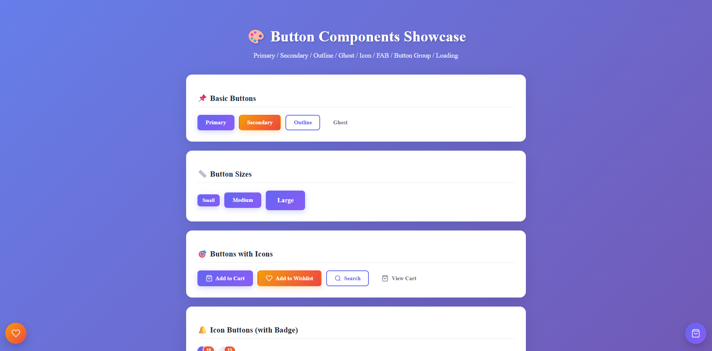

# 🎨 Button Components Library - React


A **beautiful, production-ready** collection of Button & CTA components built with **React**. Includes multiple variants, states, and interactive elements perfect for modern web applications.

## 📸 Screenshots



## ✨ Features

- 🎯 **4 Button Variants** – Primary, Secondary, Outline, Ghost
- 📏 **3 Sizes** – Small, Medium, Large
- 🎭 **Icon Buttons** – Shopping Cart, Search, Wishlist with badge notifications
- ⏳ **Loading State** – Built-in spinner for form submissions
- 🔗 **Button Groups** – Horizontal, Vertical, and Segmented controls
- 🎪 **Floating Action Button (FAB)** – WhatsApp-style floating button
- 🚫 **Disabled States** – Proper disabled styling for all variants
- 📱 **Fully Responsive** – Works perfectly on mobile, tablet, and desktop
- 🎨 **Beautiful Animations** – Smooth hover effects and transitions
- ♿ **Accessible** – ARIA labels and keyboard navigation support

## 🚀 Quick Start

### Prerequisites

- Node.js (v14 or higher)
- npm or yarn

### Installation

```bash
# Clone the repository
git clone https://github.com/SaeedForouzandeh/button-components-app.git

# Navigate to project
cd button-components-app

# Install dependencies
npm install

# Start development server
npm start
```

The app will open at **http://localhost:3000**

## 📁 Project Structure

```
src/
├── components/
│   ├── ui/
│   │   ├── Button/
│   │   │   ├── Button.jsx          # Main button component
│   │   │   ├── IconButton.jsx      # Icon-only button with badge
│   │   │   ├── FAB.jsx             # Floating Action Button
│   │   │   ├── ButtonGroup.jsx     # Button group container
│   │   │   └── index.js            # Barrel export
│   │   └── Spinner/
│   │       ├── Spinner.jsx         # Loading spinner component
│   │       └── index.js
│   └── icons/
│       ├── CartIcon.jsx            # Shopping cart SVG icon
│       ├── SearchIcon.jsx          # Search SVG icon
│       ├── HeartIcon.jsx           # Heart/wishlist SVG icon
│       └── index.js
├── App.js                          # Demo showcase page
├── App.css                         # Demo page styles
└── index.js                        # App entry point
```

## 🎮 Usage Examples

### Basic Button

```jsx
import { Button } from "./components/ui/Button";

function App() {
  return (
    <Button variant="primary" onClick={() => alert("Clicked!")}>
      Click Me
    </Button>
  );
}
```

### Button with Icon

```jsx
import { Button } from "./components/ui/Button";
import CartIcon from "./components/icons/CartIcon";

function App() {
  return (
    <Button variant="primary" icon={CartIcon}>
      Add to Cart
    </Button>
  );
}
```

### Icon Button with Badge

```jsx
import { IconButton } from "./components/ui/Button";
import CartIcon from "./components/icons/CartIcon";

function App() {
  return (
    <IconButton
      icon={CartIcon}
      label="Shopping Cart"
      badge={5}
      variant="filled"
      onClick={() => console.log("Cart clicked")}
    />
  );
}
```

### Loading Button

```jsx
import React, { useState } from "react";
import { Button } from "./components/ui/Button";

function App() {
  const [loading, setLoading] = useState(false);

  const handleSubmit = async () => {
    setLoading(true);
    await submitForm(); // Your async operation
    setLoading(false);
  };

  return (
    <Button variant="primary" loading={loading} onClick={handleSubmit}>
      {loading ? "Submitting..." : "Submit Form"}
    </Button>
  );
}
```

### Floating Action Button (FAB)

```jsx
import { FAB } from "./components/ui/Button";
import CartIcon from "./components/icons/CartIcon";

function App() {
  return (
    <FAB
      icon={CartIcon}
      label="Chat with us"
      color="primary"
      position="bottom-right"
      onClick={() => openChat()}
    />
  );
}
```

### Button Group

```jsx
import { Button, ButtonGroup } from "./components/ui/Button";

function App() {
  return (
    <ButtonGroup>
      <Button variant="outline">Left</Button>
      <Button variant="outline">Center</Button>
      <Button variant="outline">Right</Button>
    </ButtonGroup>
  );
}
```

### Segmented Control

```jsx
import React, { useState } from "react";
import { Button, ButtonGroup } from "./components/ui/Button";

function App() {
  const [view, setView] = useState("day");

  return (
    <ButtonGroup segmented>
      <Button
        variant={view === "day" ? "primary" : "ghost"}
        onClick={() => setView("day")}
      >
        📅 Day
      </Button>
      <Button
        variant={view === "week" ? "primary" : "ghost"}
        onClick={() => setView("week")}
      >
        📊 Week
      </Button>
      <Button
        variant={view === "month" ? "primary" : "ghost"}
        onClick={() => setView("month")}
      >
        📈 Month
      </Button>
    </ButtonGroup>
  );
}
```

### Full Width Button

```jsx
import { Button } from "./components/ui/Button";
import CartIcon from "./components/icons/CartIcon";

function App() {
  return (
    <Button
      variant="primary"
      size="lg"
      icon={CartIcon}
      style={{ width: "100%" }}
    >
      Proceed to Checkout - $299.99
    </Button>
  );
}
```

## 🎨 Component Props

### Button Props

| Prop       | Type        | Default     | Description                                              |
| ---------- | ----------- | ----------- | -------------------------------------------------------- |
| `variant`  | `string`    | `'primary'` | `'primary'` \| `'secondary'` \| `'outline'` \| `'ghost'` |
| `size`     | `string`    | `'md'`      | `'sm'` \| `'md'` \| `'lg'`                               |
| `loading`  | `boolean`   | `false`     | Show loading spinner                                     |
| `disabled` | `boolean`   | `false`     | Disable button                                           |
| `icon`     | `component` | `null`      | Icon component to display                                |
| `onClick`  | `function`  | `null`      | Click handler                                            |
| `style`    | `object`    | `{}`        | Custom inline styles                                     |
| `children` | `node`      | `null`      | Button content                                           |

### IconButton Props

| Prop       | Type        | Default      | Description               |
| ---------- | ----------- | ------------ | ------------------------- |
| `icon`     | `component` | **required** | Icon component            |
| `label`    | `string`    | **required** | Tooltip text (aria-label) |
| `badge`    | `number`    | `0`          | Notification badge count  |
| `variant`  | `string`    | `'default'`  | `'default'` \| `'filled'` |
| `active`   | `boolean`   | `false`      | Active state              |
| `disabled` | `boolean`   | `false`      | Disable button            |
| `onClick`  | `function`  | `null`       | Click handler             |

### FAB Props

| Prop       | Type        | Default          | Description                                                          |
| ---------- | ----------- | ---------------- | -------------------------------------------------------------------- |
| `icon`     | `component` | **required**     | Icon component                                                       |
| `label`    | `string`    | **required**     | Tooltip text (title)                                                 |
| `color`    | `string`    | `'primary'`      | `'primary'` \| `'secondary'` \| `'success'`                          |
| `position` | `string`    | `'bottom-right'` | `'bottom-right'` \| `'bottom-left'` \| `'top-right'` \| `'top-left'` |
| `onClick`  | `function`  | `null`           | Click handler                                                        |

### ButtonGroup Props

| Prop        | Type      | Default      | Description             |
| ----------- | --------- | ------------ | ----------------------- |
| `segmented` | `boolean` | `false`      | Segmented control style |
| `children`  | `node`    | **required** | Button components       |

## 🎯 Component Variants

### Button Variants

- **Primary** - Gradient purple background, white text
- **Secondary** - Gradient orange-red background, white text
- **Outline** - Transparent with purple border and text
- **Ghost** - Transparent with gray text, light background on hover

### Button Sizes

- **Small** (sm) - 13px font, compact padding
- **Medium** (md) - 15px font, default padding
- **Large** (lg) - 17px font, spacious padding

### IconButton Variants

- **Default** - Transparent, gray icon
- **Filled** - Gradient background, white icon
- **Active** - Purple tinted background for active state

### FAB Colors

- **Primary** - Purple gradient
- **Secondary** - Orange-red gradient
- **Success** - Green gradient

### FAB Positions

- `bottom-right`
- `bottom-left`
- `top-right`
- `top-left`

## 🛠️ Built With

- [React 18](https://react.dev/) - UI Library
- [Create React App](https://create-react-app.dev/) - Project bootstrapping
- Inline Styles - No external CSS dependencies

## 📦 Available Scripts

```bash
# Start development server
npm start

# Build for production
npm run build

# Run tests
npm test

# Eject configuration
npm run eject
```

## 🎯 Browser Support

| Chrome | Firefox | Safari | Edge   |
| ------ | ------- | ------ | ------ |
| ✅ 90+ | ✅ 88+  | ✅ 14+ | ✅ 90+ |

## 🤝 Contributing

Contributions are welcome! Feel free to:

1. Fork the repository
2. Create a feature branch (`git checkout -b feature/AmazingFeature`)
3. Commit your changes (`git commit -m 'Add some AmazingFeature'`)
4. Push to the branch (`git push origin feature/AmazingFeature`)
5. Open a Pull Request

## 📄 License

This project is licensed under the MIT License - see the [LICENSE](LICENSE) file for details.

## 🌟 Show Your Support

Give a ⭐️ if this project helped you!

## 📞 Contact

Saeed Forouzandeh

Project Link: [https://github.com/SaeedForouzandeh/button-components-app](https://github.com/SaeedForouzandeh/button-components-app)

---

Made with ❤️ and React
